<div align="center">



<br/>

<a href="https://www.linkedin.com/in/ayush-kumar-94310522a/"></a>
<a href="mailto:ayushkumar9315983@gmail.com"></a>
<a href="https://anotherayush.in"></a>
<a href="https://github.com/ayush931"></a>
<a href="https://x.com/anotherayush_"></a>

<br/>


<br/>

<a href="https://anotherayush.in">
  
</a>

</div>


##  A Little About Me


I build the invisible plumbing that turns messy documents into clean, structured data — and I genuinely enjoy it. Right now that means designing FastAPI + Celery pipelines that take a raw PDF, run it through OCR, restructure it into XML, and ship out a polished EPUB — at scale, without falling over.

I came into engineering sideways: a Chemistry degree, then an MBA in Marketing, then a full pivot into distributed systems and backend architecture. That path is exactly why I care as much about *why* a system exists as *how* it's built — I like sitting close to the product decision, not just the terminal.

Outside of client work, I'm usually deep in a side project — right now it's **Aetheria**, a real-time 2D multiplayer sandbox with WebRTC voice chat and live physics sync. When I'm not writing code, I'm probably tuning my terminal setup (Ghostty / WezTerm / Kitty configs are a mild obsession) or tweaking dotfiles that nobody asked me to tweak.

```js
const ayush = {
  role: "Full Stack Engineer",
  focus: ["Document Pipelines", "Real-Time Systems", "Distributed Microservices"],
  currentlyLearning: "Advanced system design & event orchestration",
  currentlyBuilding: "Real-time systems & document pipelines",
  funFact: "MBA + Chemistry degree before writing a line of production code"
};
```


##  The Numbers

<div align="center">


<br/>


<br/>


<br/><br/>


<br/><br/>


<br/><br/>

<picture>
  <source media="(prefers-color-scheme: dark)" srcset="https://raw.githubusercontent.com/ayush931/ayush931/output/github-contribution-grid-snake-dark.svg" />
  <source media="(prefers-color-scheme: light)" srcset="https://raw.githubusercontent.com/ayush931/ayush931/output/github-contribution-grid-snake.svg" />
  
</picture>

</div>


##  What I Reach For

<div align="center">

<table border="0">
<tr>
<td align="center" width="25%">

**Frontend**
<br/>
<a href="https://skillicons.dev"></a>

</td>
<td align="center" width="25%">

**Backend & Real-Time**
<br/>
<a href="https://skillicons.dev"></a>

</td>
<td align="center" width="25%">

**Data & Storage**
<br/>
<a href="https://skillicons.dev"></a>

</td>
<td align="center" width="25%">

**Infra & Tooling**
<br/>
<a href="https://skillicons.dev"></a>

</td>
</tr>
</table>

</div>


##  Things I've Built & Shipped

<div align="center">

###  [Aetheria](https://github.com/ayush931/Aetheria)

**Real-time 2D multiplayer sandbox world**

`Socket.io` `Phaser.js` `WebRTC` `Neon PostgreSQL`

A living, shared world — players move, talk, and build together in real time. Socket.io keeps state in sync at 60 FPS for 50+ concurrent players, while WebRTC handles proximity voice so nearby players can just... talk, like they're actually in the same room.

<br/>

###  [Excalidraw Clone](https://github.com/ayush931/excalidraw)

**Real-time collaborative whiteboard**

`Next.js` `WebSockets` `Turborepo` `React Memoization`

Multiple people drawing on the same canvas, at the same time, without it turning into chaos. Sub-100ms sync between users, with careful React memoization so the canvas stays smooth even when everyone's drawing at once.

<br/>

###  [RideSync](https://github.com/ayush931/cab-application)

**Real-time ride booking app**

`React Native (Expo)` `Clerk` `Neon PostgreSQL` `Zustand` `WebSockets`

A cross-platform ride-hailing app with live GPS tracking and WebSocket-driven updates — built to feel instant, from booking to pickup.

</div>


##  Where I've Worked

```
2026 ─── Present   ⚙️  NexoGrafix Private Limited
                     Document conversion pipelines,
                     an Office.js add-in for style enforcement, and
                     XML/EPUB services powering automated publishing.

2025 ─── 2026       🚚 ShipU Logistics Private Limited
                     Real-time shipment tracking on a PERN stack,
                     event-driven microservices with RabbitMQ + Docker.

2025 ─── 2025       🔧 Shabra Softech Solution Pvt. Ltd.
                     Migrated a MERN monolith into a Turborepo monorepo,
                     shipping shared web + mobile experiences.
```


##  Learning Path

```
2026 ─ Present   Master of Computer Applications — IIT Patna & IIIT Ranchi
2025             MBA, Marketing — Impact College (8.61 CGPA)
2023             B.Sc. (Hons), Chemistry — B.D. College
```

<br/>

<div align="center">


<br/><br/>


</div>
